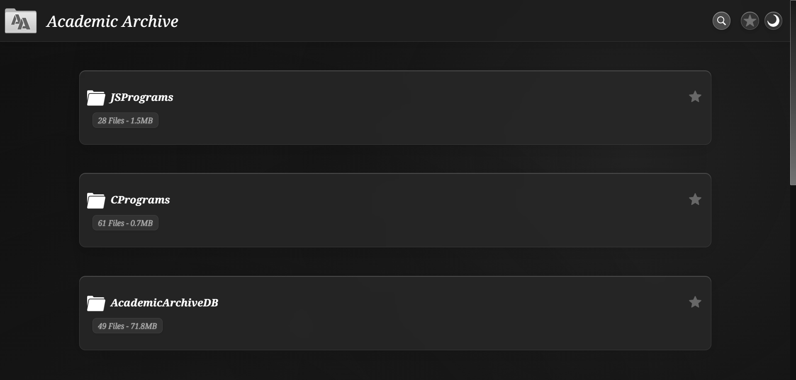

# Academic Archive: A Dynamic Digital Library

## How I Built a Dynamic, Zero-Maintenance Academic Hub with Vanilla HTML, CSS, and JavaScript

Welcome to a behind-the-scenes look at the Academic Archive. My vision was to create a centralized, digital repository for academic resources—notes, syllabi, code, and more. I wanted a platform that was not only easy to navigate but also incredibly simple to update. This project is built entirely with vanilla HTML, CSS, and JavaScript, with a focus on a clean, modern aesthetic and a dynamic, content-driven architecture that pulls everything directly from GitHub.

## Core Philosophy: A GitHub-Powered Digital Library

The standout feature of the Academic Archive is its **dynamic nature**. All the content you see—every folder, file, and repository—is loaded directly from GitHub repositories defined in a simple `data.json` file. This approach effectively separates the data from the presentation, meaning I can add new notes, projects, or even entire courses by simply pushing to a GitHub repository and updating a single line in the JSON file. The website then automatically renders the new content, with no HTML edits required.

## Key Features

* **JSON-Driven Content**: Easily update all site content by modifying a single JSON file, making maintenance effortless.
* **Multi-Repository Support**: The platform can render content from multiple GitHub repositories, offering a comprehensive and integrated view of diverse academic sources.
* **Dual-Theme System**: A sleek toggle allows users to switch between a modern dark theme and a clean light theme, with settings powered by CSS variables for a seamless transition.
* **Glassmorphism UI**: The design incorporates a beautiful glass-like effect using `backdrop-filter`, giving elements like the navbar, folders, and modals a translucent, modern feel.
* **Fully Responsive**: The layout seamlessly adapts to all screen sizes, from mobile phones to desktops, using a combination of Flexbox and CSS Grid.
* **Enhanced Viewing**: Enjoy a smooth viewing experience with integrated modals for PDFs, images, and code snippets, allowing you to preview content without leaving the page.
* **Powerful Search**: A responsive search bar allows you to quickly find any resource, even within nested folders, ensuring you can locate what you need without delay.
* **Pinning and Filtering**: Pin your most important folders for quick access, and use the toggle to view only your pinned items for a focused, personalized experience.

## Technical Implementation

### JavaScript: The Engine of the Site

The entire site is rendered by a master script that runs on page load. It reads the repository configurations from `data.json`, fetches the repository data from the GitHub API, and then uses DOM manipulation to build the HTML structure. Functions iterate through the repository contents, creating and appending elements like folders and files to their respective containers. This modular approach keeps the `index.html` file clean and minimal, acting as a skeleton that JavaScript brings to life.

### CSS: Crafting the Atmosphere

The styling is built upon modern CSS principles:

* **CSS Variables (Custom Properties)**: The theming system is powered by variables defined in the `:root`. A simple attribute toggle on the `<html>` element swaps out all color and gradient values, instantly changing the site's entire look.
* **Glassmorphism**: The frosted glass effect is achieved using `background: rgba(...)` for transparency and `backdrop-filter: blur(...)` to blur the content behind the element, creating a sense of depth and modernity.
* **Responsive Layouts**: I used a combination of Flexbox for one-dimensional alignment (like in the navigation bar and file items) and CSS Grid for complex two-dimensional layouts. Media queries ensure the structure reflows elegantly on smaller screens.
* **Animations & Transitions**: Keyframe animations and smooth `transition` properties are applied to interactive elements like folders, modals, and buttons for a polished and engaging user experience.

## A Tour Through the Dynamic Sections

* **Multi-Repository Folders**: The main view is a dynamic rendering of the folder structures from the specified GitHub repositories, providing an intuitive and organized way to browse through different subjects and projects.
* **Integrated Viewers**: Clicking on a file opens it in a sleek modal viewer. PDFs, images, and code are all displayed in a clean, focused environment without navigating away from the main page.
* **Recent Files**: The platform keeps track of your recently viewed files, providing a convenient way to quickly access the materials you're currently working with.
* **Usage Dashboard**: For the more technically inclined, a usage dashboard provides real-time information about GitHub API rate limits and allows for easy management of the repositories displayed on the site.

## Conclusion

The Academic Archive is more than just a static webpage; it's a **dynamic and easily maintainable platform for academic resources**, built from the ground up with vanilla technologies. This project demonstrates my ability to structure a project for scalability and ease of maintenance, a core principle in modern web development.

> Feel free to explore the live version and see how modern web technologies can create engaging, maintainable experiences!

[View Live Project](https://krishnasinghprojects.github.io/AcademicArchive/)