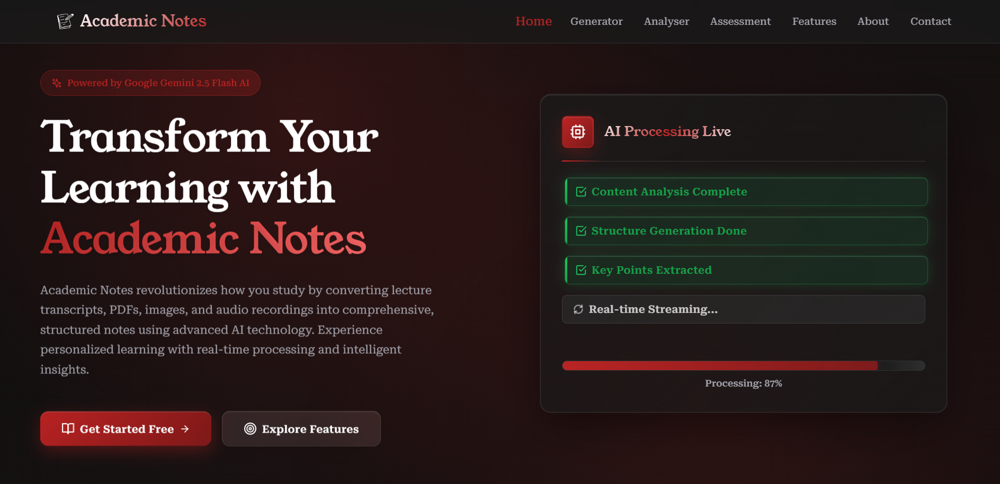
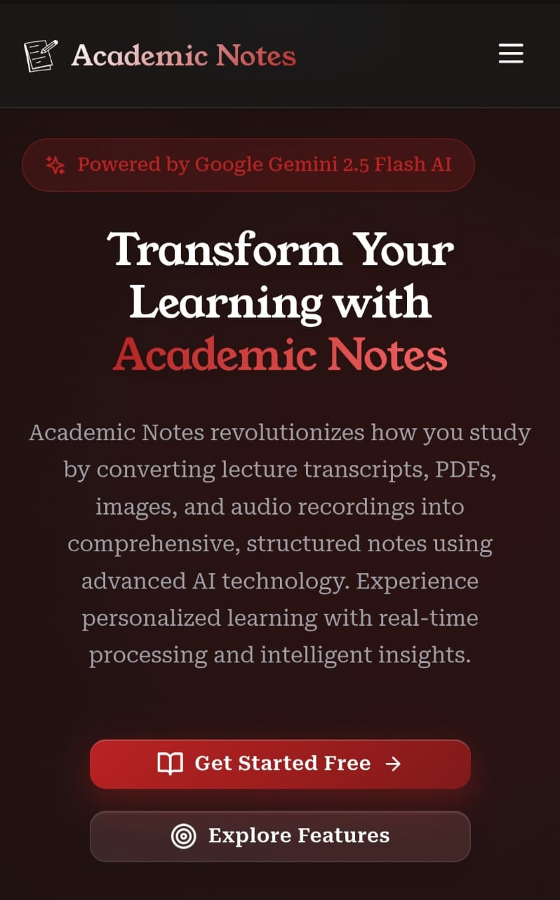
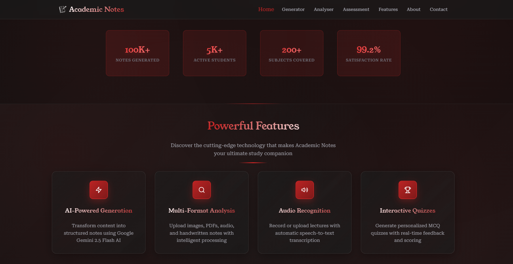
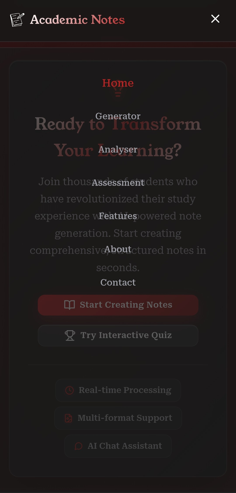
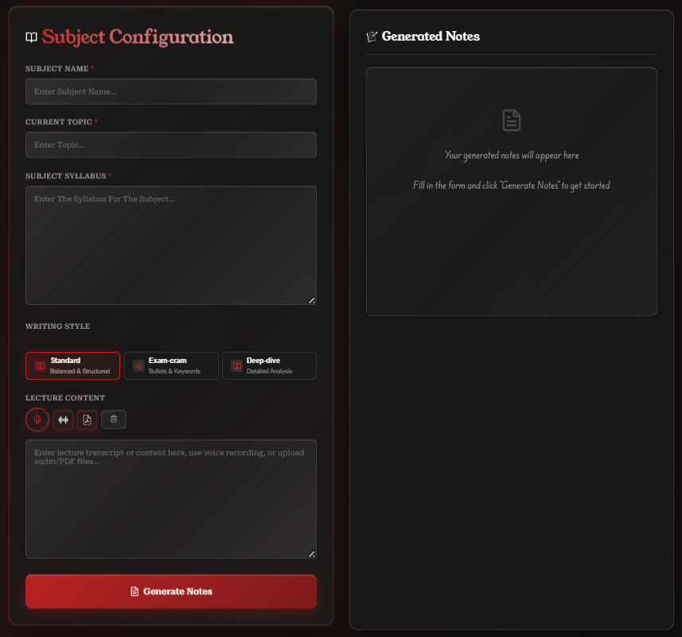
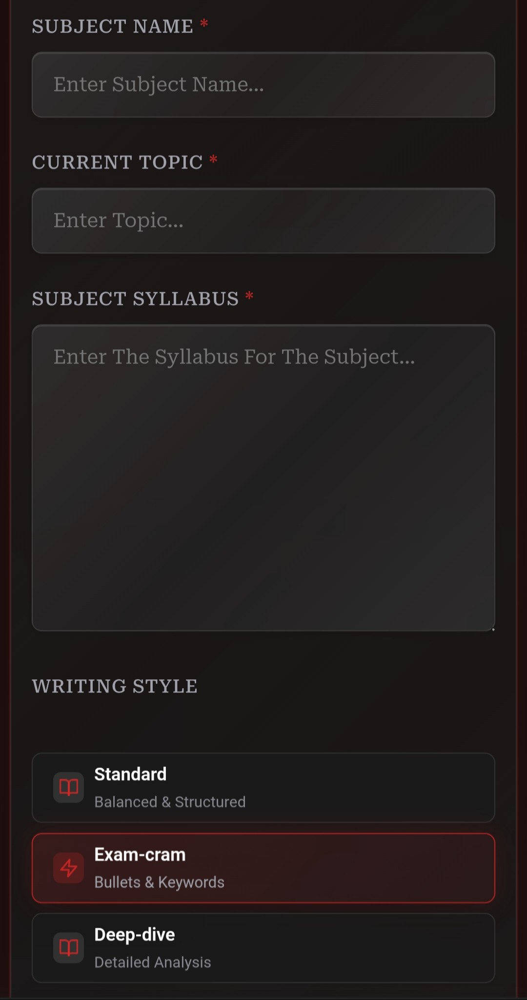
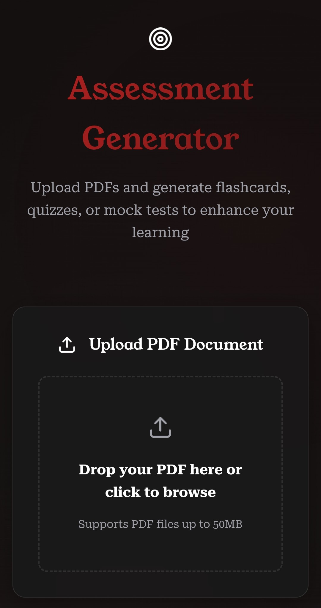
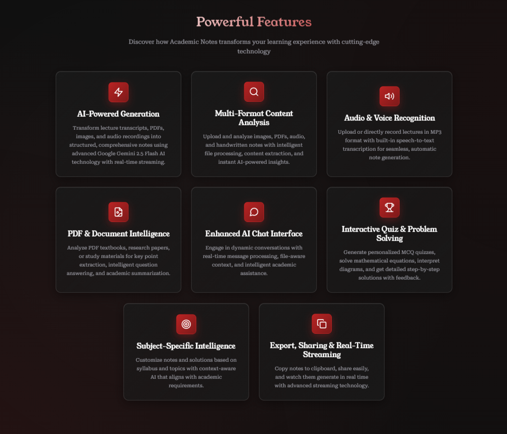
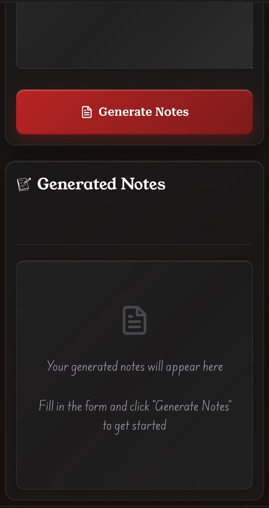

# Academic Notes: A Deep Dive

## How I Built an AI-Powered Application for Comprehensive Academic Support with the MERN Stack and Google Gemini

Welcome to a behind-the-scenes look at my Academic Notes application. My goal was to create more than just a simple note-taking app; I wanted a **dynamic, intelligent, and comprehensive academic assistant** that could handle a wide variety of inputs and provide a rich, interactive learning experience. This project is built with the MERN (MongoDB, Express.js, React, Node.js) stack and leverages the power of Google's Gemini AI to provide a suite of advanced features.

## Core Philosophy: An All-in-One AI-Powered Academic Hub

The standout feature of this application is its **multi-modal, AI-driven core**. The application accepts a wide variety of inputs, including typed text, audio recordings, PDFs, and even images of handwritten notes. All of this content is processed by a powerful backend that uses the Google Gemini API to generate structured notes, provide in-depth analysis, and even create interactive quizzes. This approach allows students to use the application in whatever way best suits their learning style and the materials they have on hand.

## Key Features

* **AI-Powered Note Generation:** Transform lecture transcripts, PDFs, images, and audio recordings into structured, comprehensive notes using advanced Google Gemini 2.5 Flash AI technology with real-time streaming.
* **Multi-Format Content Analysis:** Upload and analyze images, PDFs, audio, and handwritten notes with intelligent file processing, content extraction, and instant AI-powered insights.
* **Audio & Voice Recognition:** Upload or directly record lectures in MP3 format with built-in speech-to-text transcription for seamless, automatic note generation.
* **PDF & Document Intelligence:** Analyze PDF textbooks, research papers, or study materials for key point extraction, intelligent question answering, and academic summarization.
* **Enhanced AI Chat Interface:** Engage in dynamic conversations with real-time message processing, file-aware context, and intelligent academic assistance.
* **Interactive Quiz & Problem Solving:** Generate personalized MCQ quizzes, solve mathematical equations, interpret diagrams, and get detailed step-by-step solutions with feedback.
* **Subject-Specific Intelligence:** Customize notes and solutions based on syllabus and topics with context-aware AI that aligns with academic requirements.
* **Export, Sharing & Real-Time Streaming:** Copy notes to clipboard, share easily, and watch them generate in real time with advanced streaming technology.

## Technical Implementation

### Frontend: A Modern, Responsive User Experience with React

The frontend is built with React and Vite, providing a fast, modern, and responsive user experience. The UI is designed with a "glassmorphism" aesthetic, giving it a clean and contemporary feel. The application is a single-page application (SPA) with different "pages" rendered as components.

Key frontend components and features include:

* **A multi-page layout** for "Home," "Generator," "Analyzer," "Assessment," "Features," and "About," allowing for a clear and intuitive user flow.
* **A rich text editor** for inputting and editing notes, with support for markdown and real-time streaming of AI-generated content.
* **File upload functionality** for audio, PDF, and image files, with a sleek and user-friendly interface.
* **An interactive quiz component** with multiple-choice questions, a timer, and a results screen.
* **A chat interface** for real-time interaction with the AI, allowing users to ask questions and get instant feedback.

### Backend: A Powerful and Scalable Foundation with Node.js and Express

The backend is built with Node.js and Express, providing a robust and scalable foundation for the application. It handles all of the heavy lifting, including file uploads, API requests to the Google Gemini AI, and real-time streaming of data to the frontend.

Key backend features include:

* **A RESTful API** for handling all of the application's data and functionality.
* **Integration with the Google Gemini API** for all AI-powered features, including note generation, content analysis, and quiz creation.
* **Real-time streaming** of AI-generated content to the frontend, providing a dynamic and engaging user experience.
* **File upload and processing** for a variety of file types, including audio, PDF, and image files.

## A Tour Through the Application's Features

* **The Note Generator:** The core of the application, the Note Generator allows you to input content in a variety of ways and get beautifully formatted, AI-generated notes in return. You can type or paste text, record audio, or upload a file, and the application will handle the rest.
* **The Content Analyzer:** The Analyzer allows you to upload an image, PDF, or audio file and get an in-depth analysis of the content. This is perfect for getting a quick summary of a long document, understanding a complex diagram, or transcribing a lecture.
* **The Assessment Feature:** The Assessment feature allows you to test your knowledge with interactive quizzes. You can generate a quiz based on your notes or a specific topic, and the application will provide you with a score and detailed feedback.
* **The AI Chat:** The AI Chat allows you to have a real-time conversation with the AI, ask questions, and get instant feedback. This is a great way to get help with a difficult concept, clarify a point from your notes, or just have a fun and engaging conversation about your studies.

## Conclusion

The Academic Notes application is a powerful and versatile tool that can help students of all levels to learn more effectively. By combining a modern and intuitive user interface with the power of Google's Gemini AI, the application provides a rich and engaging learning experience that is second to none.

## Deployed Link

[View Live](https://notes.krishnasingh.live)