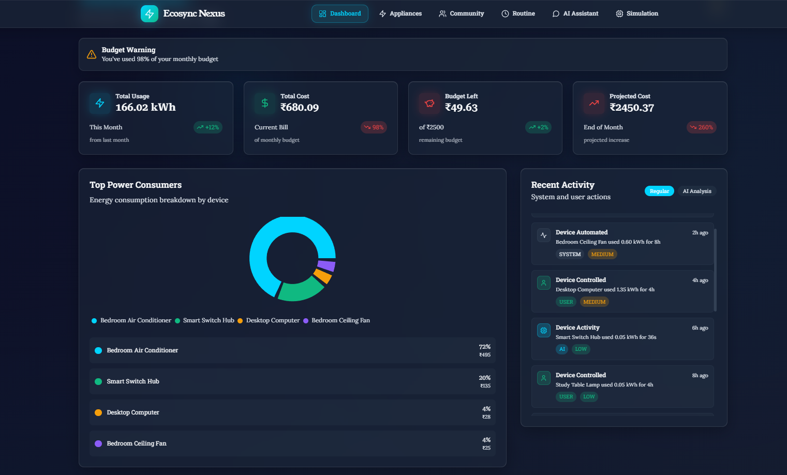
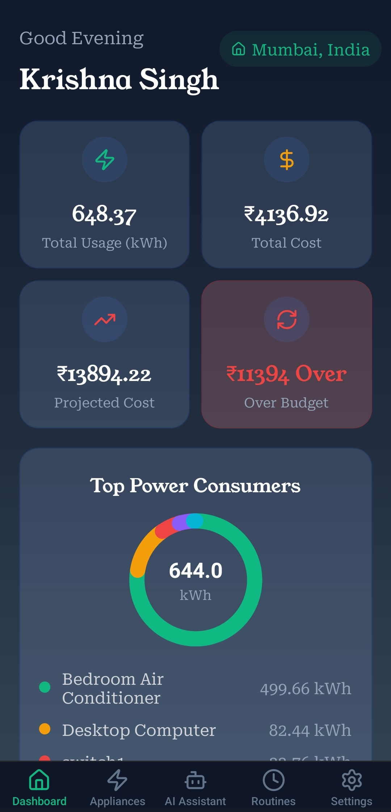
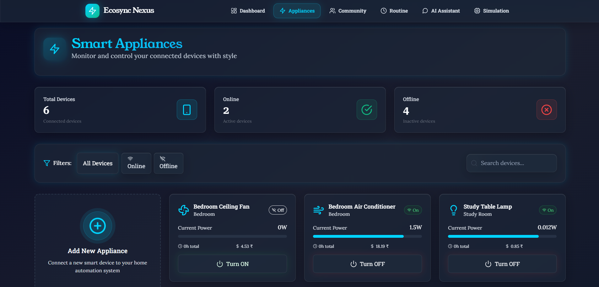
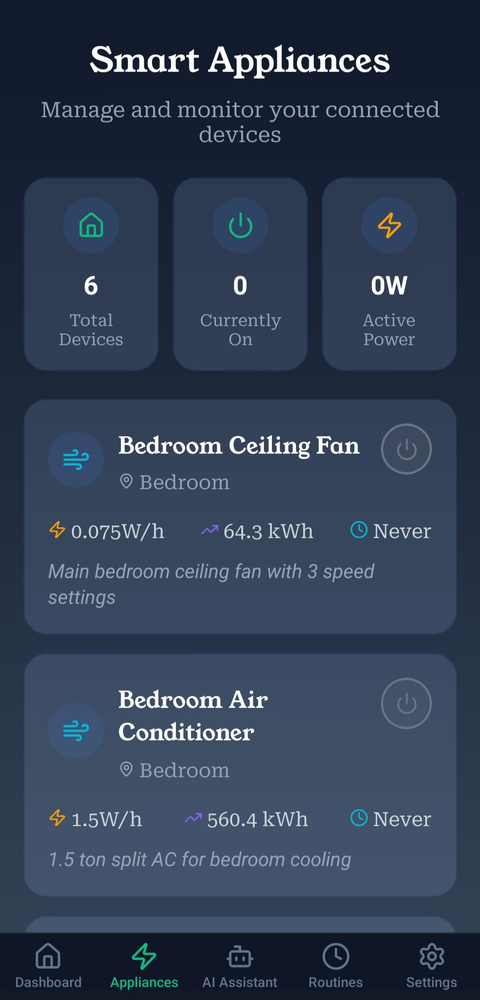
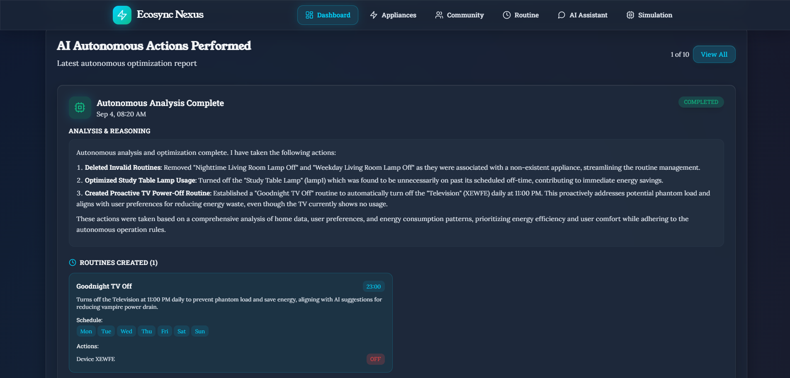
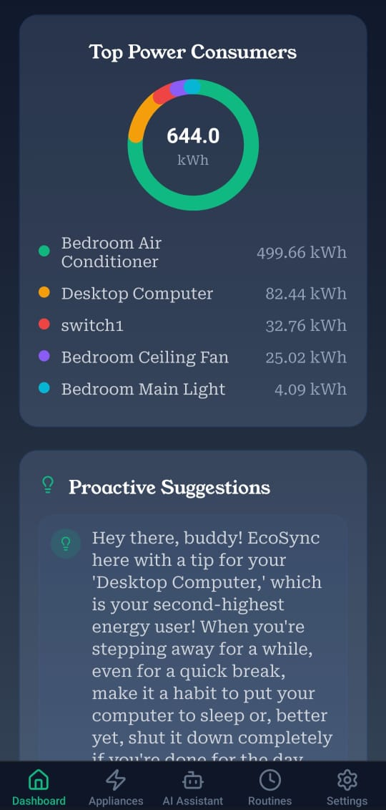
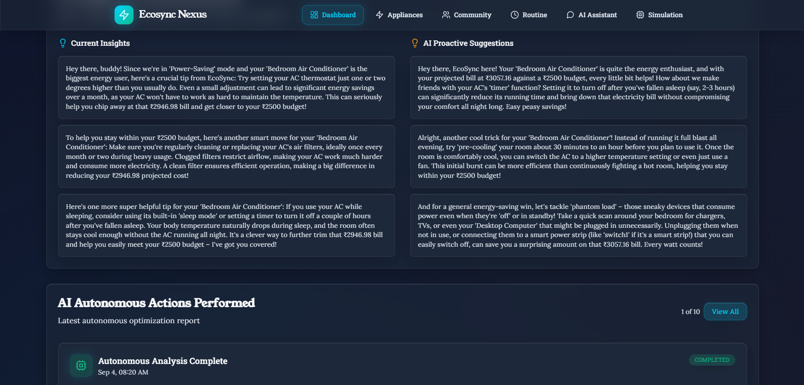
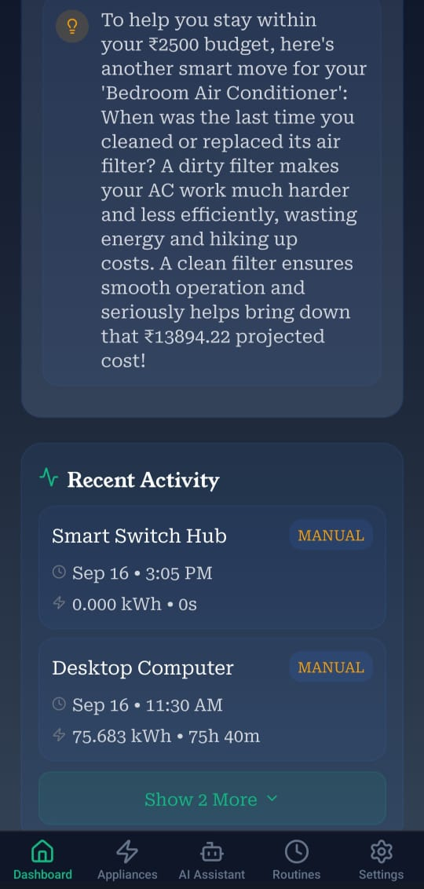
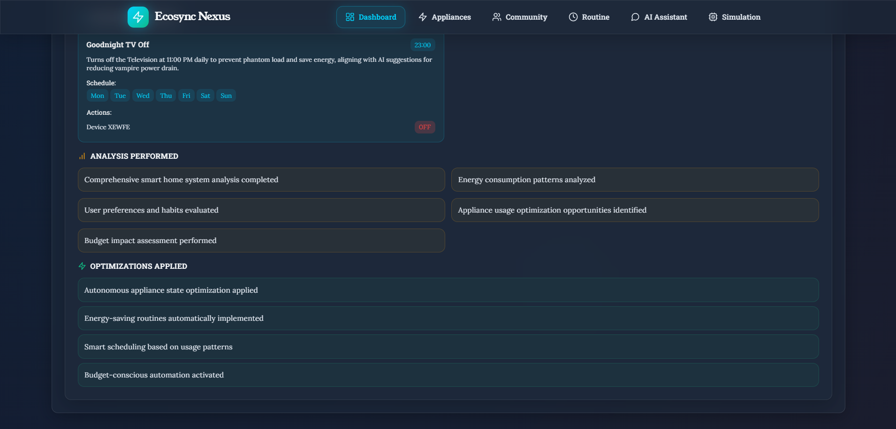
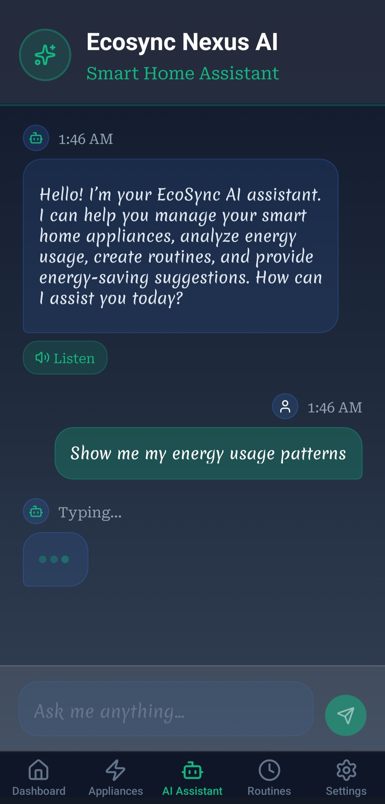

# Ecosync Nexus: A Full-Stack Smart Home Revolution

## How I Built an End-to-End Smart Home Management System with a Node.js Backend, React Native App, and Custom ESP32 Firmware

Welcome to a deep dive into Ecosync Nexus, a complete smart home ecosystem I engineered from the ground up during the 30-hour Sustainovation 2025 hackathon. My vision was to create a seamless, intuitive, and intelligent platform that not only offers remote control over home appliances but also empowers users with actionable insights to promote energy efficiency and sustainable living. This project spans the full stack, from custom hardware firmware to a secure cloud backend and a polished cross-platform mobile application.

## Core Philosophy: An Integrated and Intelligent Ecosystem

The standout feature of Ecosync Nexus is its **holistic, end-to-end architecture**. Unlike off-the-shelf solutions, every component of this system was designed to work in perfect harmony. The journey begins with a custom-built smart switch, powered by an ESP32 microcontroller, which retrofits any standard appliance with smart capabilities. This device communicates with a secure, custom-built RESTful API, which in turn serves data to a feature-rich React Native application. The result is a tightly integrated ecosystem that offers unparalleled control, real-time feedback, and AI-driven automation.

## Key Features

* **Full-Stack Control**: An end-to-end solution covering hardware firmware, a secure backend, and a cross-platform mobile application for a seamless user experience.
* **Smart Appliance Retrofitting**: Custom C++ firmware for the ESP32 microcontroller turns any traditional appliance into a smart device using relays and efficient polling architecture.
* **AI-Powered Autonomous Mode**: Integrated Google Gemini API on the backend analyzes usage patterns to intelligently manage appliances, optimizing for energy savings without user intervention.
* **Real-Time Energy Monitoring**: A granular data logging system provides per-appliance energy consumption dashboards, offering users deep insights into their daily usage patterns.
* **Personalized Budget Tracking**: Users can set monthly energy goals, view real-time cost projections, and receive intelligent alerts to stay on budget and promote sustainable habits.
* **Remote & Voice Control**: The React Native application provides intuitive remote appliance management, including both text-based and voice commands for hands-free operation.
* **Customizable Routines**: Create personalized routines to automate daily tasks, such as turning off all lights at bedtime or starting the coffee maker in the morning.
* **Secure User Authentication**: Robust and secure user management handled via Firebase Google Authentication for a frictionless and safe onboarding experience.

## Technical Implementation

### Backend: The Node.js and Express Powerhouse

The backbone of the Ecosync Nexus ecosystem is a secure and scalable RESTful API built with Node.js and Express. It serves as the central hub for managing all data, user authentication, and device communication.

* **API Architecture**: The API is architected to handle requests for user authentication, device registration, appliance state management, and data logging for energy consumption.
* **Secure Authentication**: User sign-in and registration are managed through Firebase Google Authentication, ensuring a secure and reliable system.
* **AI Integration**: The backend integrates the Google Gemini API to power the Autonomous Mode. This service fetches historical usage data from the logging system, analyzes patterns, and makes intelligent decisions to optimize energy usage.
* **IoT Endpoint**: A dedicated API endpoint is designed to handle communication from the ESP32 devices, allowing them to report their status and receive commands efficiently.

### Firmware: The C++ Smart Switch

To bring smart capabilities to existing appliances, I developed custom firmware for the ESP32 microcontroller using C++.

* **Polling Architecture**: The firmware utilizes an efficient polling architecture to constantly check for state changes and user commands, ensuring a responsive and reliable system.
* **Hardware Integration**: The ESP32 is integrated with relays to physically control the power flow to appliances, effectively retrofitting them with smart capabilities.
* **Backend Communication**: The firmware is programmed to communicate with the dedicated IoT endpoint on the backend, sending status updates and fetching commands over Wi-Fi.

### Mobile Application: The React Native Command Center

The user-facing component of Ecosync Nexus is a sleek and feature-rich Android application built from scratch with React Native.

* **Cross-Platform Development**: React Native was chosen to allow for future expansion to iOS with a single codebase.
* **Real-Time Dashboards**: The application features dynamic, real-time dashboards that visualize energy consumption data, allowing users to track their usage per appliance and over time.
* **Intuitive Controls**: Users can remotely control their appliances with simple taps, create custom routines, and even use voice commands for a hands-free experience.
* **Budget and Alerts**: A dedicated section for budget tracking allows users to set monthly goals and receive alerts when they are approaching their limits, encouraging more mindful energy consumption.

## A Tour Through the Application's Features

* **The Dashboard**: The main dashboard provides an at-a-glance view of your home's energy consumption, highlighting the most energy-hungry appliances and your progress toward your monthly budget.
* **Appliance Management**: A simple and intuitive interface allows you to view the status of all your connected appliances and toggle them on or off with a single tap.
* **Routine Creation**: The routines section allows you to create custom automation rules based on time of day or specific triggers, making your home work for you.
* **AI Autonomous Mode**: With the flip of a switch, you can enable the AI-powered Autonomous Mode and let Ecosync Nexus intelligently manage your appliances to save energy and money.

## Conclusion

Ecosync Nexus is more than just a smart home app; it's a **complete, full-stack ecosystem** that I designed, developed, and deployed in just 30 hours. This project demonstrates my ability to work across the entire technology stack, from hardware and firmware to backend services and mobile application development, to create a cohesive and powerful solution.

> This project showcases my passion for building integrated systems that solve real-world problems and my ability to deliver a comprehensive product under tight deadlines.

## Repository Links
[Video Demonstration](https://youtu.be/dw1rLopQCcU)
[Backend Repository](https://github.com/krishnasinghprojects/EcosyncNexusBackend)
[Mobile App Reponsitory](https://github.com/krishnasinghprojects/EcosyncNexusMobile)