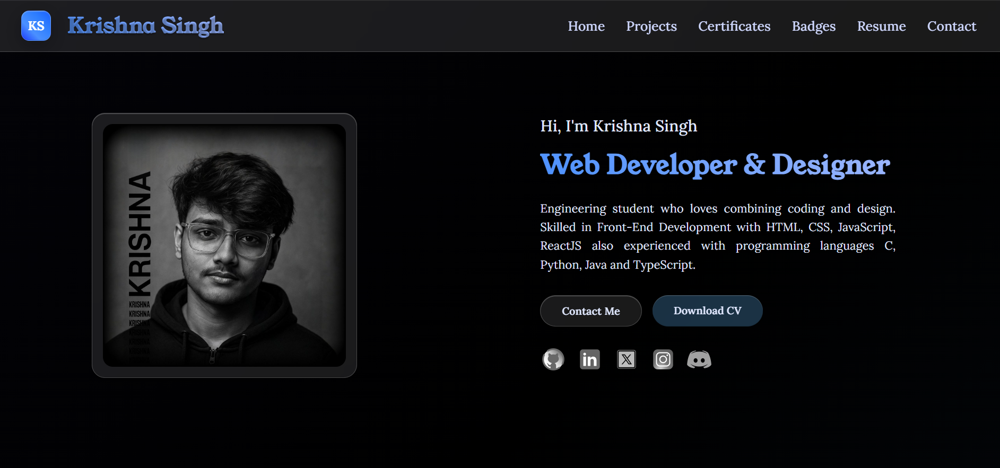
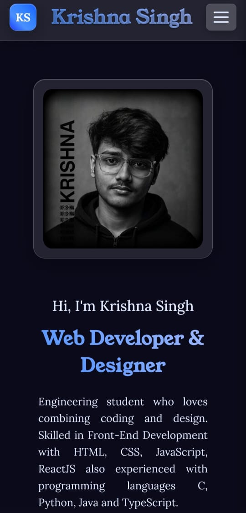
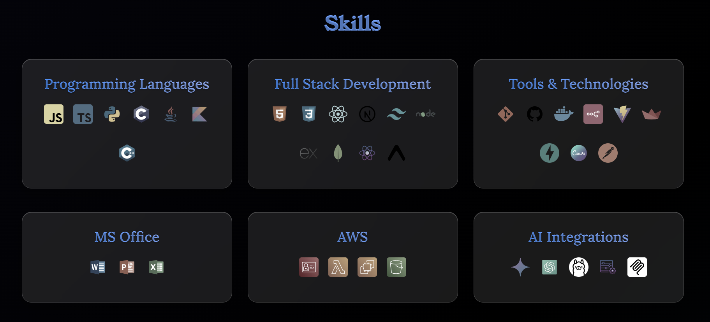
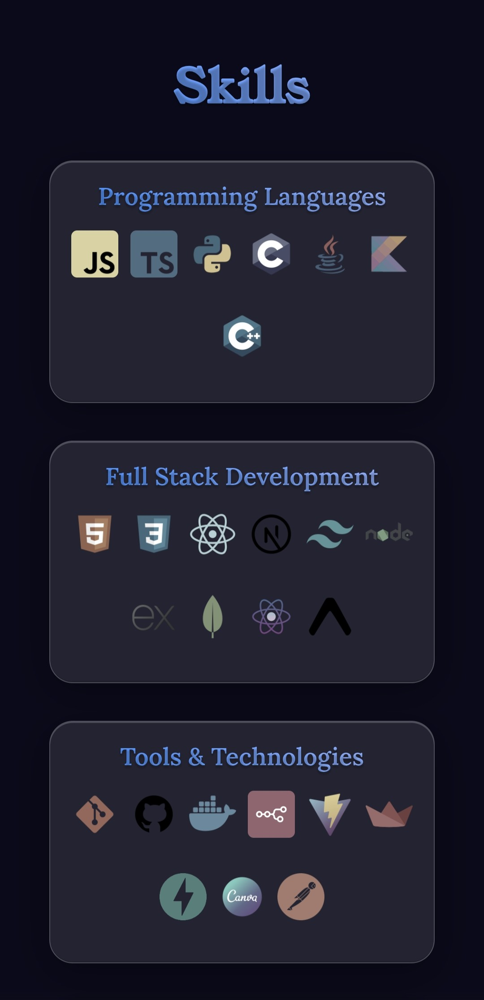
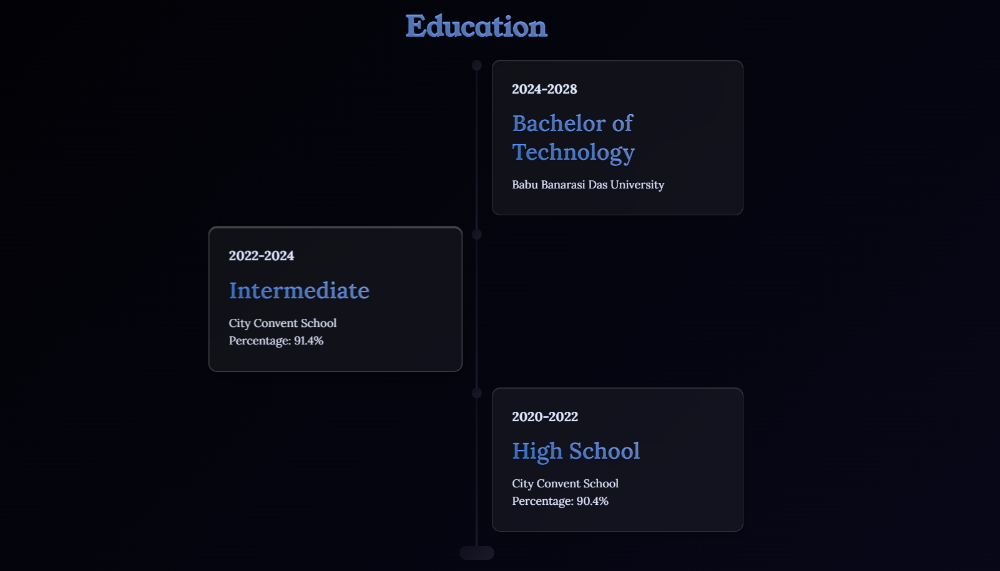
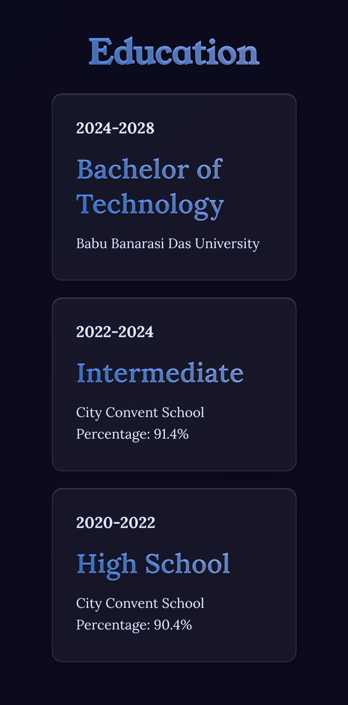

# My Dynamic Portfolio: A Deep Dive

## How I Built a Maintainable Personal Site with a Custom Rendering Engine in Vanilla JavaScript

Welcome to a behind-the-scenes look at my personal portfolio. My goal was to create more than just a static page; I wanted a **living, breathing showcase** of my work that was incredibly easy to update without ever touching the HTML. This project is built entirely with vanilla HTML, CSS, and JavaScript, focusing on a clean, modern aesthetic and, most importantly, a dynamic, content-driven architecture that tells my story as a developer.

## Core Philosophy: A Narrative-Driven Portfolio

The standout feature of this portfolio is its **dynamic, story-driven architecture**. All the content you see—from my personal details and project descriptions to my skills and the entire developer timeline—is loaded from either a central `info.js` object or external Markdown files (`.md`). This approach effectively separates the data from the presentation. I can add a new project by simply updating a JavaScript object, or add a new chapter to my developer journey by editing a simple Markdown file. The website's custom JavaScript engine then automatically parses and renders all the new content, no HTML edits required.

## Key Features

* **Content-Driven Architecture:** All site content is dynamically loaded from a central `info.js` file, making maintenance and updates effortless.
* **Developer Journey Timeline:** A fully interactive, horizontal timeline that visually tells my story as a developer, parsed and rendered from a dedicated `timeline.md` file.
* **Custom Markdown Parser:** Blog posts for each project are written in Markdown and rendered into HTML on the fly by a custom-built JavaScript parser, allowing for rich, easy-to-edit project deep dives.
* **Modular JavaScript Engine:** The site is powered by a suite of custom JavaScript modules, including a main renderer, a modal manager, and individual parsers for different content types.
* **Dual-Theme System:** A sleek toggle allows users to switch between a dark, modern theme and a clean, light theme, with settings powered by CSS variables.
* **Glassmorphism UI:** The design incorporates a beautiful glass-like effect using `backdrop-filter`, giving elements like the navbar, buttons, and cards a translucent, modern feel.
* **Integrated Modal System:** A centralized modal manager handles the display of project blog posts, an interactive resume viewer, certificates, and the developer journey map, creating a seamless single-page experience.

## Technical Implementation

### JavaScript: The Custom-Built Engine of the Site

The entire site is rendered by a master script that runs on page load. It reads the `details` object from `info.js` and uses a series of functions to build the HTML structure via DOM manipulation. The architecture is modular, with separate scripts for handling different functionalities:

* **`info.js`**: Acts as a central database for the majority of the site's content, including personal details, projects, skills, and certificates.
* **`markdown-parser.js`**: A custom-built parser that fetches `.md` files for blog posts, converts Markdown syntax (like headers, lists, and images) into HTML, and injects it into the blog modal.
* **`timeline-parser.js`**: A specialized parser that reads the `timeline.md` file, interprets its unique structure, and dynamically generates the interactive horizontal timeline, complete with expandable cards for more detail.
* **`modal-manager.js`**: Controls all modal windows on the site, ensuring a consistent and smooth user experience for viewing blog posts, certificates, the resume, and the journey map.

This modular approach keeps the `index.html` file clean and minimal, acting as a skeleton that the JavaScript engine brings to life.

### CSS: Crafting the Atmosphere

The styling is built upon modern CSS principles:

* **CSS Variables (Custom Properties):** The theming system is powered by variables defined in the `:root`. A simple class toggle on the `body` element swaps out all color and gradient values, instantly changing the site's entire look.
* **Glassmorphism:** The frosted glass effect is achieved using `background: rgba(...)` for transparency and `backdrop-filter: blur(...)` to blur the content behind the element.
* **Responsive Layouts:** I used a combination of Flexbox for one-dimensional alignment (like in navigation bars) and CSS Grid for complex two-dimensional layouts (like the skills section). Media queries ensure the structure reflows elegantly on smaller screens.
* **Animations & Transitions:** Keyframe animations and smooth `transition` properties are applied to interactive elements for a polished and engaging user experience.

## A Tour Through the Dynamic Sections

* **About Me & Projects:** The hero section and project cards are populated directly from the objects and arrays within `info.js`. Clicking a project card triggers the `markdown-parser.js` to fetch and render the corresponding blog post.
* **Developer Journey:** This section is generated entirely by `timeline-parser.js`, which reads the `timeline.md` file and constructs the interactive timeline, showcasing my growth and key milestones as a developer.
* **Skills, Certificates, and Badges:** These gallery-style sections are generated by iterating through arrays in the `info.js` object. Each card, image, and badge is created on the fly.
* **Education Timeline:** The education history is built into a responsive timeline layout, with each entry being a separate object in the `education` array from `info.js`.

## Conclusion

This portfolio is more than just a static webpage; it's a **fully dynamic and easily maintainable platform** built from the ground up with a custom vanilla JavaScript engine. This project demonstrates my ability to architect a scalable and maintainable project, moving beyond simply using frameworks to understanding and building the core logic that powers a modern web application.

> Feel free to explore the live version and see how vanilla web technologies can create rich, engaging, and maintainable experiences!

[View Live Portfolio](https://krishnasingh.live/)